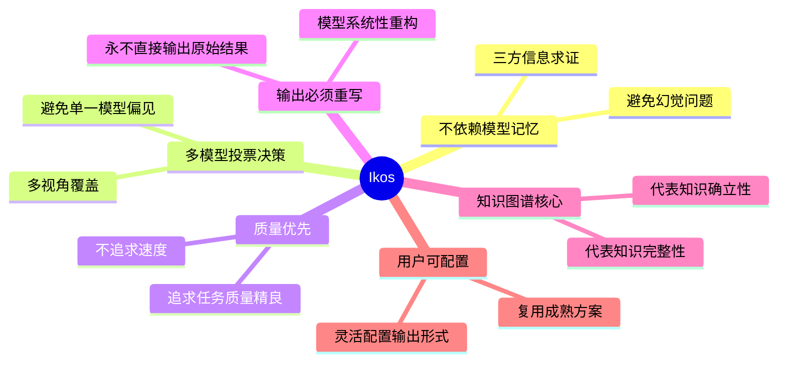
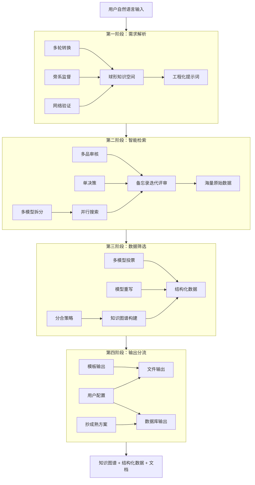

# 易构 / Ikos

> **智能知识构建系统**

从网络信息到结构化知识 — 多轮 AI 深度挖掘与重构平台。

[](LICENSE) []()

---

## 📖 项目概述

**易构（Ikos）** 是一个可控输出的智能知识构建系统。它从网络实时检索信息，通过多轮 AI 处理与多模型投票决策，最终输出结构化的知识产物（数据库、Markdown 文档、PDF、知识图谱等）。

本系统不是传统 RAG（检索增强生成），而是**深度知识挖掘与重构平台**：

| 维度 | 传统 RAG | 易构 Ikos |
|------|---------|----------|
| 数据来源 | 预设知识库 | 网络实时检索 |
| 处理深度 | 单次检索 + 生成 | 多轮迭代处理 |
| 输出形式 | 文本回复 | 结构化知识产物 |
| 可控性 | 有限 | 全程可配置 |

---

## ✨ 核心特性

### 🎯 核心理念



| 理念 | 说明 |
|------|------|
| **不依赖模型记忆** | 使用三方信息求证，避免模型幻觉和知识过期问题 |
| **多模型投票决策** | 避免单一模型的偏见和盲区，提高决策可靠性 |
| **质量优先** | 不追求速度，追求任务质量精良 |
| **输出必须重写** | 原始数据必须经过模型系统性重写，确保输出质量 |
| **知识图谱核心** | 知识图谱贯穿全流程，代表知识的完整性和确立性 |
| **用户可配置** | 灵活配置输出形式，复用成熟方案 |

---

## 🏗️ 系统架构

### 四阶段总览



### 各阶段说明

| 阶段 | 核心机制 | 共同原则 |
|------|----------|----------|
| **第一阶段：需求解析** | 多轮转换 + 旁系监督 | 多方参与、监督验证 |
| **第二阶段：智能检索** | 多模型拆分 + 多品审核 | 投票决策、去伪存真 |
| **第三阶段：数据筛选** | 分合策略 + 多模型投票 | 质量优先、图谱构建 |
| **第四阶段：输出分流** | 用户配置 + 模板输出 | 用户可控、抄成熟方案 |

---

## 🚀 快速开始

### 环境要求

- Python 3.13+
- UV 包管理器（可选，推荐）

### 安装步骤

```bash
# 克隆仓库
git clone https://github.com/jamsyan/Ikos.git
cd Ikos

# 创建虚拟环境
python -m venv .venv
source .venv/bin/activate  # Linux/macOS
.venv\Scripts\activate     # Windows

# 使用 UV 安装依赖（推荐，阿里云镜像加速）
uv pip install -e ".[dev]"

# 或使用 pip
pip install -e ".[dev]"
```

### 安装 Playwright 浏览器

```bash
playwright install
```

### 运行测试

```bash
pytest
```

```bash
# 运行主程序
python main.py
```

---

## 📁 项目结构

```
Ikos/
├── README.md              # 项目说明
├── pyproject.toml         # 项目配置（依赖、工具配置）
├── .pre-commit-config.yaml # Git 钩子配置
├── .gitignore            # Git 忽略文件
├── src/ikos/             # 源代码
│   ├── core/             # 核心抽象接口
│   ├── stage1_requirement/  # 第一阶段：需求解析
│   ├── stage2_search/       # 第二阶段：智能检索
│   ├── stage3_filter/       # 第三阶段：数据筛选
│   ├── stage4_output/       # 第四阶段：输出分流
│   ├── ui/                 # UI 模块
│   └── utils/              # 工具函数
├── config/               # 配置文件
│   ├── settings.yaml     # 主配置
│   ├── models.yaml       # 多模型配置
│   └── prompts/          # 提示词模板
├── data/                 # 数据目录（.gitignore 忽略）
├── docs/                 # 文档
└── tests/                # 测试
```

---

## 📝 开发计划

> 当前进度：**Phase 0 & Phase 1 已完成** ✅

- [x] **Phase 0: 项目骨架**
  - [x] 项目配置（pyproject.toml, UV 阿里云镜像）
  - [x] 开发工具配置（Black, Ruff, Pyright, Pylint）
  - [x] 目录结构创建
  - [x] Sphinx 文档系统配置
- [x] **Phase 1: 核心层实现**
  - [x] ModelProvider 抽象接口
  - [x] OllamaProvider 实现
  - [x] OpenAICompatibleProvider 实现
  - [x] SearchProvider 抽象接口
  - [x] PlaywrightSearchProvider 实现
  - [x] VoteEngine 投票引擎
- [ ] **Phase 2: 模型集成**
  - [ ] Ollama 安装指南
  - [ ] 多模型配置测试
- [ ] **Phase 3: 搜索接入**（已完成 ✅）
  - [x] Playwright 搜索实现
  - [x] 多引擎适配
- [ ] **Phase 4: 四阶段业务实现**
  - [ ] 第一阶段：需求解析
  - [ ] 第二阶段：智能检索
  - [ ] 第三阶段：数据筛选
  - [ ] 第四阶段：输出分流
- [ ] **Phase 5: UI 开发**
- [ ] **Phase 6: 测试与优化**

---

## 📄 许可证

本项目采用 **AGPL-3.0** 许可证。

### 简单来说

- ✅ **个人使用**：完全免费，可自由修改和使用
- ✅ **商业使用**：如通过网络提供服务，必须开源整个服务代码
- ✅ **衍生作品**：任何修改或基于本项目的作品也必须采用 AGPL-3.0

如需商业授权（无需开源您的代码），请联系项目作者。

查看完整许可证文件：[LICENSE](LICENSE)

---

## 🤝 参与贡献

虽然是个人项目，但欢迎：

- 💡 提出建议（Issues）
- 🔧 提交代码（Pull Requests）
- 📝 完善文档

---

## 📧 联系方式

- 📧 Email: jihanyang123@163.com
- 💬 Issues: [GitHub Issues](https://github.com/jamsyan/Ikos/issues)
- 👤 作者：[@jamsyan](https://github.com/jamsyan)

---

<div align="center">

**易构 Ikos** — 从信息到知识，深度挖掘与构建

*Made with ❤️ for knowledge builders*

</div>
