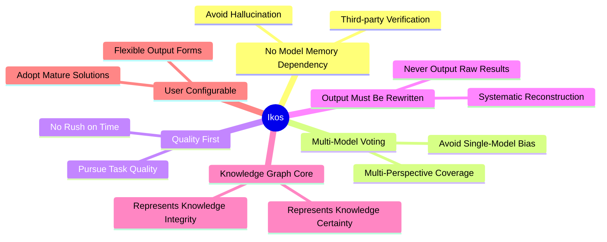
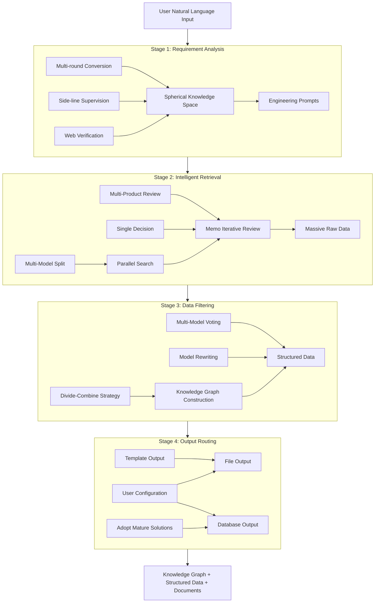

# Ikos

> **Intelligent Knowledge Building System**

From web information to structured knowledge — a multi-round AI deep mining and reconstruction platform.

[](LICENSE) []()

---

## 📖 Overview

**Ikos** is an intelligent knowledge building system with controllable output. It retrieves information from the web in real-time, processes it through multiple rounds of AI iteration and multi-model voting, and finally outputs structured knowledge products (databases, Markdown documents, PDFs, knowledge graphs, etc.).

This system is **not** a traditional RAG (Retrieval-Augmented Generation), but rather a **Deep Knowledge Mining and Reconstruction Platform**:

| Dimension | Traditional RAG | Ikos |
|-----------|-----------------|------|
| Data Source | Preset knowledge base | Real-time web retrieval |
| Processing Depth | Single retrieval + generation | Multi-round iterative processing |
| Output Format | Text response | Structured knowledge products |
| Controllability | Limited | Fully configurable |

---

## ✨ Key Features

### 🎯 Core Philosophy



| Philosophy | Description |
|------------|-------------|
| **No Model Memory Dependency** | Use third-party verification to avoid model hallucination and outdated knowledge |
| **Multi-Model Voting Decision** | Avoid single-model bias and blind spots, improve decision reliability |
| **Quality First** | No rush on time, pursue excellent task quality |
| **Output Must Be Rewritten** | Raw data must be systematically rewritten by models to ensure output quality |
| **Knowledge Graph Core** | Knowledge graph runs through the entire process, representing knowledge integrity and certainty |
| **User Configurable** | Flexible output configuration, adopt mature solutions |

---

## 🏗️ Architecture

### Four-Stage Overview



### Stage Description

| Stage | Core Mechanism | Common Principles |
|-------|----------------|-------------------|
| **Stage 1: Requirement Analysis** | Multi-round conversion + Side-line supervision | Multi-party participation, supervision & validation |
| **Stage 2: Intelligent Retrieval** | Multi-model split + Multi-product review | Voting decision, filtering truth from falsehood |
| **Stage 3: Data Filtering** | Divide-combine strategy + Multi-model voting | Quality first, knowledge graph construction |
| **Stage 4: Output Routing** | User configuration + Template output | User controllable, adopt mature solutions |

---

## 🚀 Quick Start

> ⚠️ **Status**: Architecture design completed, under development

### Requirements

- Python 3.10+
- (TBD: Specific dependencies)

### Installation

```bash
# Clone repository
git clone https://github.com/jamsyan/Ikos.git
cd Ikos

# Create virtual environment
python -m venv .venv
source .venv/bin/activate  # Linux/macOS
.venv\Scripts\activate     # Windows

# Install dependencies
pip install -r requirements.txt
```

### Usage

```bash
# Run main program
python main.py
```

---

## 📁 Project Structure

```
Ikos/
├── README.md              # English documentation (main)
├── README_zh.md           # Chinese documentation
├── LICENSE                # AGPL-3.0 License
├── 智能知识构建系统架构文档.md  # Full architecture document (Chinese)
├── main.py                # Main entry point
├── pyproject.toml         # Project configuration
├── .python-version        # Python version
└── (TBD)                  # TODO: Module directories
```

---

## 📝 Roadmap

> This project adopts AI-assisted development mode. Core modules in planning:

- [ ] **Stage 1: Requirement Analysis Mechanism**
  - [ ] Multi-round prompt construction
  - [ ] Side-line supervision system
  - [ ] Web verification integration
- [ ] **Stage 2: Intelligent Retrieval Mechanism**
  - [ ] Multi-model split search
  - [ ] Multi-product review system
  - [ ] Memo iterative review
- [ ] **Stage 3: Data Filtering Mechanism**
  - [ ] Divide-combine strategy implementation
  - [ ] Multi-model voting system
  - [ ] Knowledge graph construction
- [ ] **Stage 4: Output Routing Mechanism**
  - [ ] User configuration interface
  - [ ] Template output system
  - [ ] Database output module

---

## 📄 License

This project is licensed under **AGPL-3.0**.

### In Simple Terms

- ✅ **Personal Use**: Completely free, modify and use freely
- ✅ **Commercial Use**: If providing service over network, must open-source entire service code
- ✅ **Derivative Works**: Any modifications or works based on this project must also use AGPL-3.0

For commercial licensing (without open-sourcing your code), please contact the project author.

View full license: [LICENSE](LICENSE)

---

## 🤝 Contributing

Although this is a personal project, contributions are welcome:

- 💡 Suggestions (Issues)
- 🔧 Code submissions (Pull Requests)
- 📝 Documentation improvements

---

## 📧 Contact

- 📧 Email: jihanyang123@163.com
- 💬 Issues: [GitHub Issues](https://github.com/jamsyan/Ikos/issues)
- 👤 Author: [@jamsyan](https://github.com/jamsyan)

---

<div align="center">

**Ikos** — From Information to Knowledge, Deep Mining and Building

*Made with ❤️ for knowledge builders*

</div>
