# 智能知识构建系统 - 完整架构文档

> **文档创建时间**：2026-03-29  
> **项目状态**：架构设计完成，待技术选型和开发实施

---

## 目录

- [一、项目定位](#一项目定位)
- [二、核心设计理念](#二核心设计理念)
- [三、四阶段总览](#三四阶段总览)
- [四、第一阶段：需求解析机制](#四第一阶段需求解析机制)
- [五、第二阶段：智能检索机制](#五第二阶段智能检索机制)
- [六、第三阶段：数据筛选机制](#六第三阶段数据筛选机制)
- [七、第四阶段：输出分流机制](#七第四阶段输出分流机制)
- [八、系统关键创新点](#八系统关键创新点)
- [九、示例场景：傅里叶变换知识检索](#九示例场景傅里叶变换知识检索)
- [十、设计一致性总结](#十设计一致性总结)
- [十一、后续工作方向](#十一后续工作方向)

---

## 一、项目定位

**智能知识构建系统**是一个可控输出的智能检索引擎，核心特点是：

- **从网络获取信息** → **多轮AI处理** → **结构化输出**
- 不是传统RAG，而是**"深度知识挖掘与重构平台"**
- **输出可控**：数据库、MD文件、PDF、知识图谱等多种形式

### 核心价值主张

本系统区别于传统RAG（检索增强生成）架构，主要体现在以下几个维度：

| 维度   | 传统RAG   | 本系统     |
|------|---------|---------|
| 数据来源 | 预设知识库   | 网络实时检索  |
| 处理深度 | 单次检索+生成 | 多轮迭代处理  |
| 输出形式 | 文本回复    | 结构化知识产物 |
| 可控性  | 有限      | 全程可配置   |

---

## 二、核心设计理念

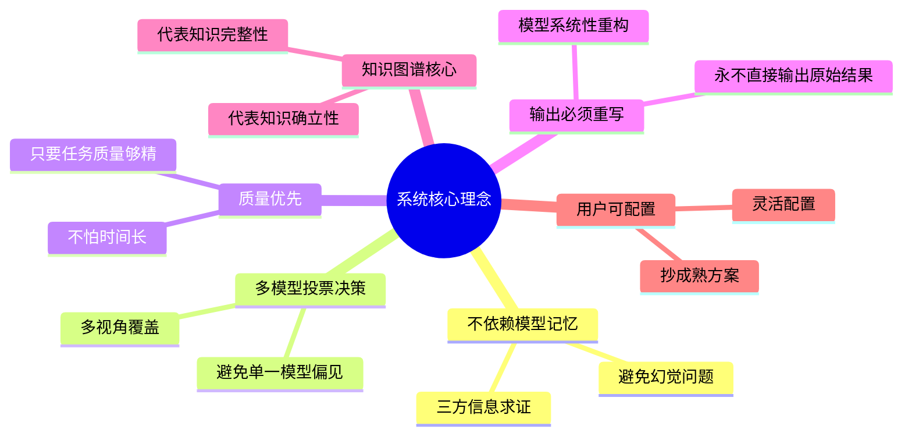

### 理念详解

| 编号 | 理念      | 说明                     |
|----|---------|------------------------|
| ①  | 不依赖模型记忆 | 使用三方信息求证，避免模型幻觉和知识过期问题 |
| ②  | 多模型投票决策 | 避免单一模型的偏见和盲区，提高决策可靠性   |
| ③  | 质量优先    | 不追求速度，追求任务质量精良         |
| ④  | 输出必须重写  | 原始数据必须经过模型系统性重写，确保输出质量 |
| ⑤  | 知识图谱核心  | 知识图谱贯穿全流程，代表知识的完整性和确立性 |
| ⑥  | 用户可配置   | 灵活配置输出形式，复用成熟方案        |

---

## 三、四阶段总览

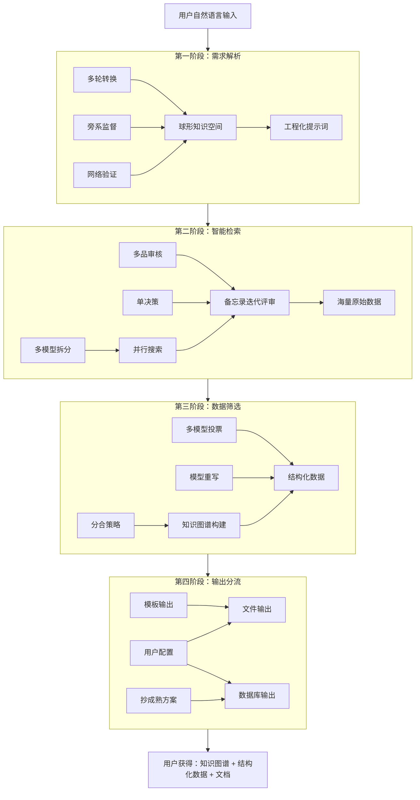

### 各阶段核心设计摘要

| 阶段   | 核心机制         | 共同原则       |
|------|--------------|------------|
| 第一阶段 | 多轮转换 + 旁系监督  | 多方参与、监督验证  |
| 第二阶段 | 多模型拆分 + 多品审核 | 投票决策、去伪存真  |
| 第三阶段 | 分合策略 + 多模型投票 | 质量优先、图谱构建  |
| 第四阶段 | 用户配置 + 模板输出  | 用户可控、抄成熟方案 |

---

## 四、第一阶段：需求解析机制

### 4.1 阶段目标

将用户的自然语言输入，通过多轮转换与验证，最终输出工程化提示词，为后续智能检索阶段提供明确的搜索方向和目标。

### 4.2 整体流程架构

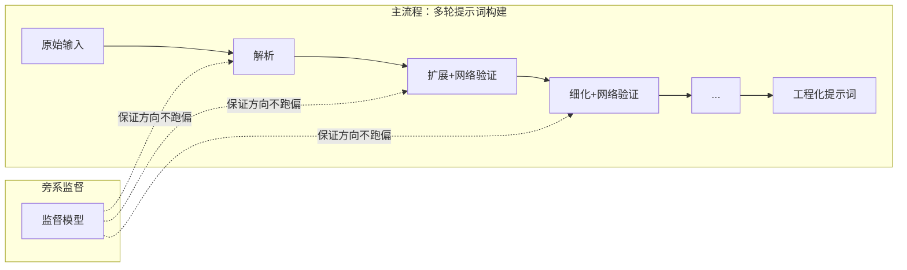

### 4.3 核心设计点

#### 4.3.1 验证方式

**原则：不依赖模型记忆，用三方信息求证，避免幻觉**

- 穿插网络搜索进行验证
- 不依赖模型的内置知识库
- 避免模型记忆过期和幻觉问题

#### 4.3.2 轮次机制

**动态 + 固定上限**

| 特性    | 说明              |
|-------|-----------------|
| 上限控制  | 有最大轮次限制（如10轮）   |
| 自适应   | 内部根据需求复杂度决定实际轮次 |
| 复杂度判断 | AI模型自评，决定需要多少轮  |

#### 4.3.3 扩展方向

**关键词 + 连锁搜索**

- 不是精准搜索，而是**"往死里搜"**
- 从一个点扩展到面，形成知识网络
- 示例：傅里叶变换 → 傅里叶本人 → 提出背景 → 数学原理 → 关联应用

#### 4.3.4 边界控制

**旁系监督模型**

- 每轮变换都有监督
- 只管**"方向不跑偏"**
- 不负责信息可信度验证（那是后续筛查系统的事）

### 4.4 网络验证触发机制

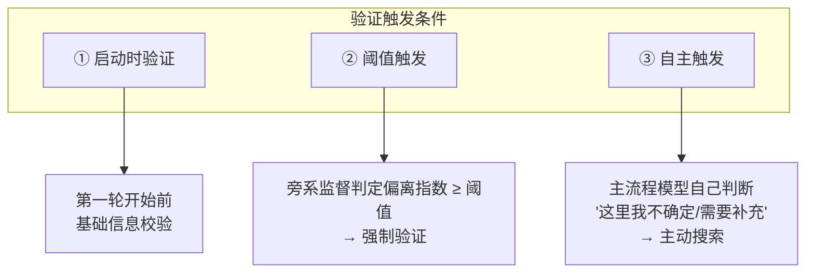

### 4.5 连锁搜索核心隐喻：球形知识空间

#### 4.5.1 核心概念图示

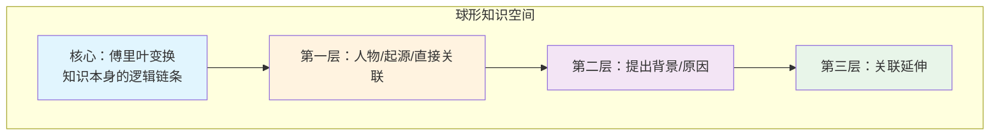

#### 4.5.2 正确与错误示例

| 场景   | 示例                               | 判定            |
|------|----------------------------------|---------------|
| ❌ 错误 | 核心圈是【傅里叶变换的数学原理】→ 跳到【拿破仑的政治生涯】   | 跑偏！虽有关联但超出核心圈 |
| ✅ 正确 | 核心圈是【傅里叶变换的数学原理】→ 延伸到【三角级数的历史发展】 | 在核心圈内（知识逻辑链）  |

#### 4.5.3 相关度判定原则

- 以知识本身的逻辑链条为核心
- 围绕圆心/球心展开
- 不跳出核心圈（如：中国政策不应跳到美国政治）
- **允许球形扩展，但不允许跨圈跳跃**

### 4.6 监督模型职责边界

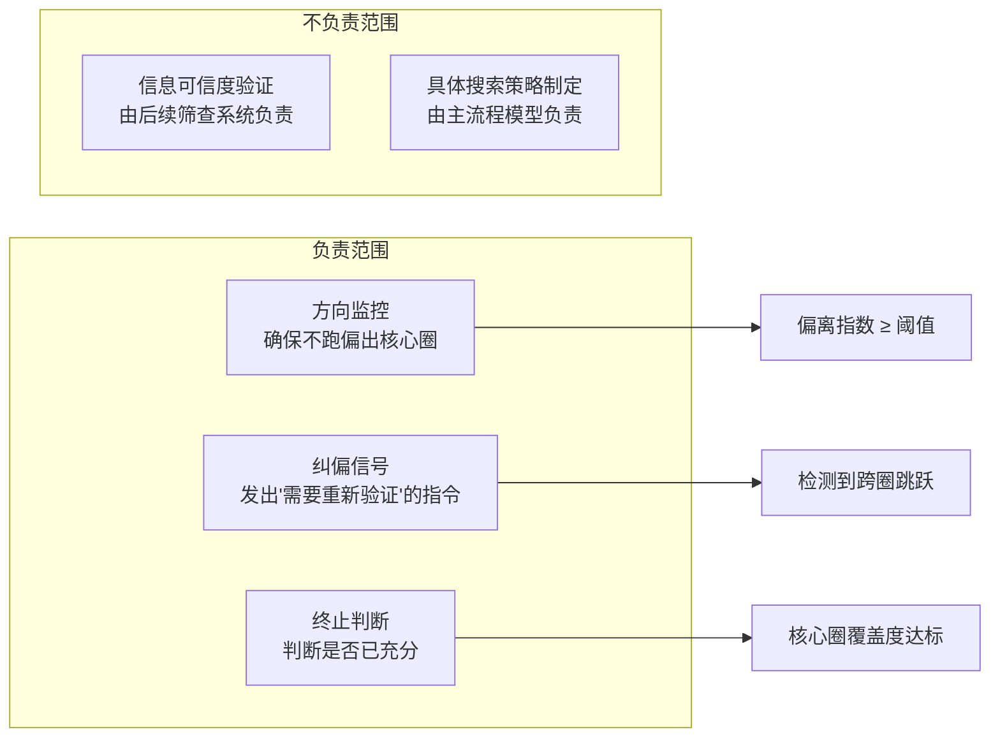

### 4.7 数据量处理策略

**前面"往死里搜"，后面"筛到死"**

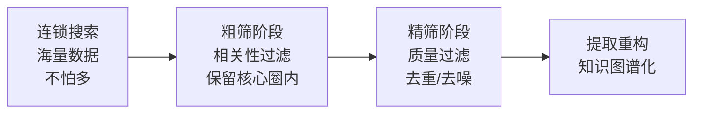

### 4.8 第一阶段输出

| 输出项    | 说明               |
|--------|------------------|
| 工程化提示词 | 经过验证、结构化、可执行的提示词 |
| 核心圈定义  | 明确的知识边界，用于后续筛查   |
| 复杂度评估  | 用于指导后续阶段的资源分配    |

### 4.9 待后续版本迭代优化

- 轮次上限的具体数值（目前暂定10轮）
- 偏离阈值的精确设定
- 球形知识空间半径的动态调整机制

---

## 五、第二阶段：智能检索机制

### 5.1 阶段目标

接收第一阶段输出的工程化提示词，通过多模型投票拆分任务、并行搜索发现、备忘录迭代评审，最终产出海量原始网络数据，为后续数据筛选阶段提供素材。

### 5.2 整体流程架构

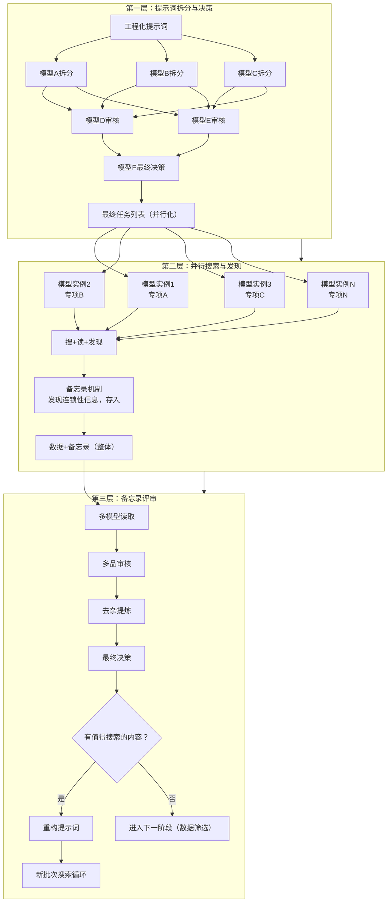

### 5.3 多模型投票机制

#### 5.3.1 角色分工

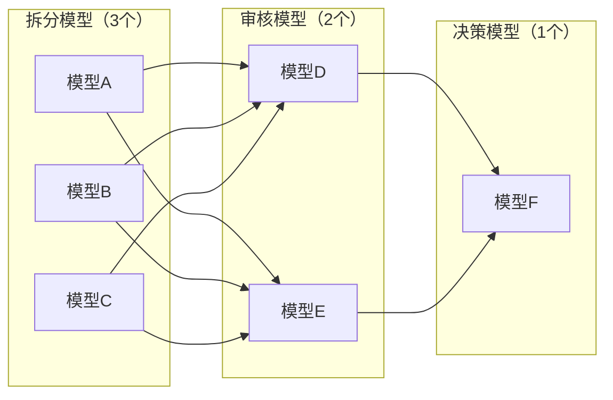

| 角色   | 数量        | 职责             |
|------|-----------|----------------|
| 拆分模型 | 3个（A/B/C） | 各自独立拆分提示词为任务列表 |
| 审核模型 | 2个（D/E）   | 双重审核拆分结果的合理性   |
| 决策模型 | 1个（F）     | 综合投票，产出最终任务列表  |

#### 5.3.2 核心逻辑

- **三拆分 → 双审核 → 单决策**
- 避免单一模型的偏见和遗漏
- 多视角覆盖，减少盲区

### 5.4 系统提示词设计

#### 5.4.1 核心两条

| 编号 | 核心内容                | 详细说明                  |
|----|---------------------|-----------------------|
| ①  | 告诉模型当前在做什么事         | 任务上下文、目标、核心圈定义        |
| ②  | 让模型验证备忘录条目与整体任务的相关性 | 这个条目和我们当前专业方向接近程度是多少？ |

#### 5.4.2 示例

```
系统提示词：
"当前任务：研究傅里叶变换的数学知识
核心主题：傅里叶变换
请验证以下备忘录条目是否与主线相关：

备忘录条目：傅里叶与皇室的关系
→ 模型判断：如果皇室推动了数学理论发展，相关；如果扯到皇室家里狗的事，不相关
```

### 5.5 备忘录机制

#### 5.5.1 核心特性

| 特性     | 说明                    |
|--------|-----------------------|
| 批次整体处理 | 不是单条触发，而是整批评审         |
| 搜+读+发现 | 模型在搜索过程中发现连锁性信息，存入备忘录 |
| 迭代触发   | 备忘录有内容时触发评审流程         |

#### 5.5.2 评审流程

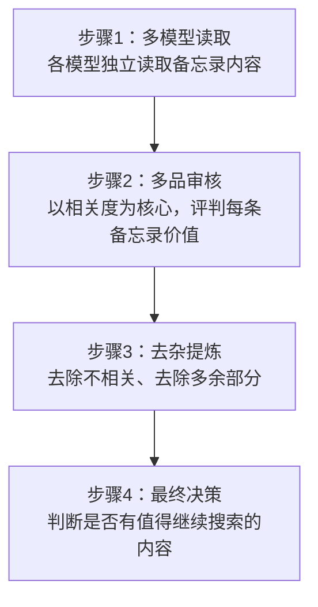

### 5.6 相关度评判原则

#### 5.6.1 点及面方式

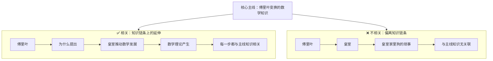

**判断依据：LLM模型自身能力 + 系统提示词引导**

#### 5.6.2 与第一阶段的联系

- 继承第一阶段的**"球形知识空间"**概念
- 以核心主题为圆心，知识链条为半径
- 允许球形扩展，不允许跨圈跳跃

### 5.7 终止条件

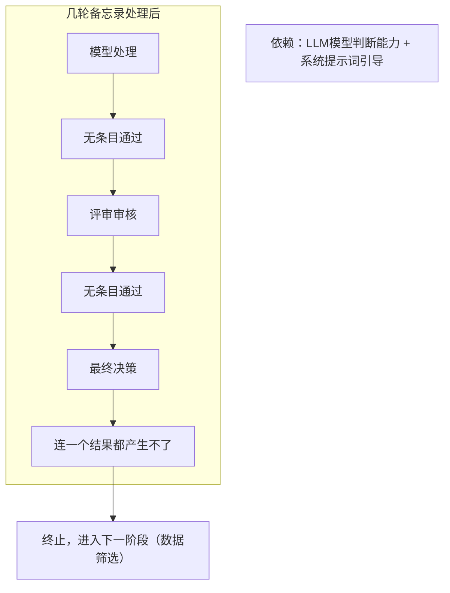

### 5.8 批次循环示意

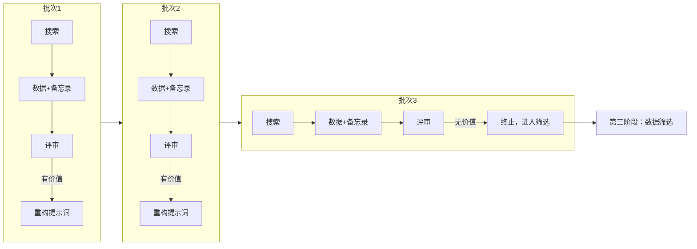

### 5.9 设计一致性

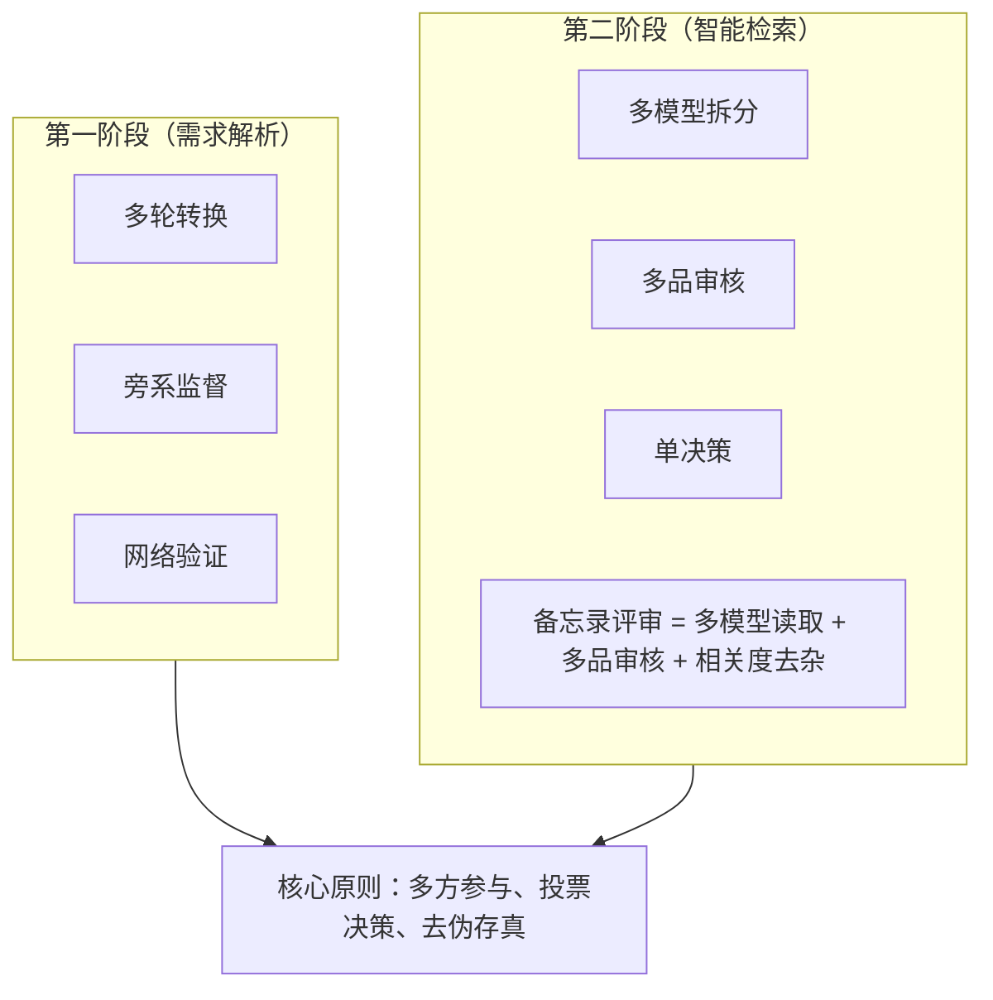

### 5.10 第二阶段输出

| 输出项     | 说明             |
|---------|----------------|
| 原始数据    | 海量网络数据（HTML等）  |
| 备忘录评审结果 | 已验证的相关条目       |
| 核心圈定义继承 | 从第一阶段传递下来的知识边界 |

### 5.11 待后续版本迭代优化

- 模型实例数量配置化
- 评审流程的并行优化
- 备忘录存储结构设计

---

## 六、第三阶段：数据筛选机制

### 6.1 阶段目标

接收第二阶段产出的海量原始数据（HTML等），通过多轮筛选、知识图谱构建、模型重写，最终产出精炼的结构化数据，为第四阶段输出分流做准备。

### 6.2 核心理念

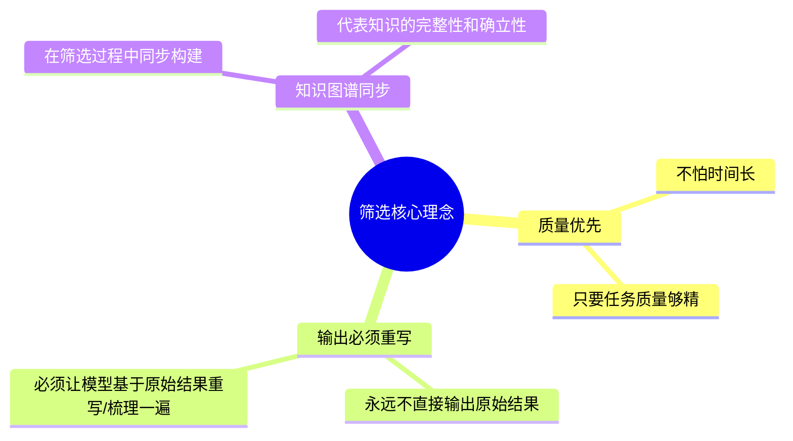

### 6.3 整体流程架构

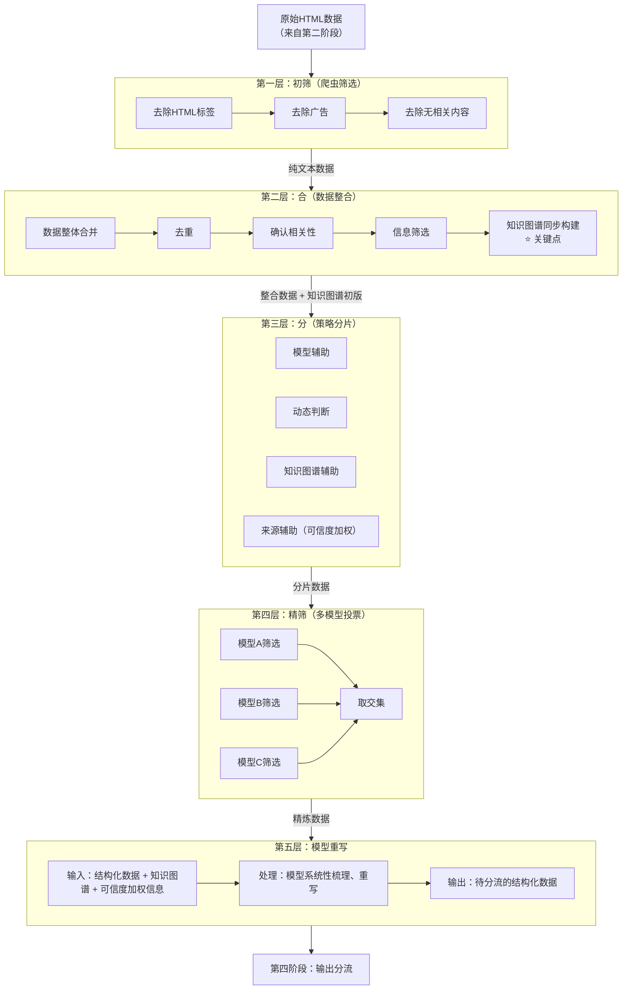

### 6.4 分合策略详解

#### 6.4.1 分分合合核心逻辑

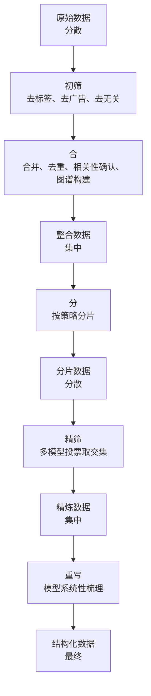

### 6.5 分片策略四要素

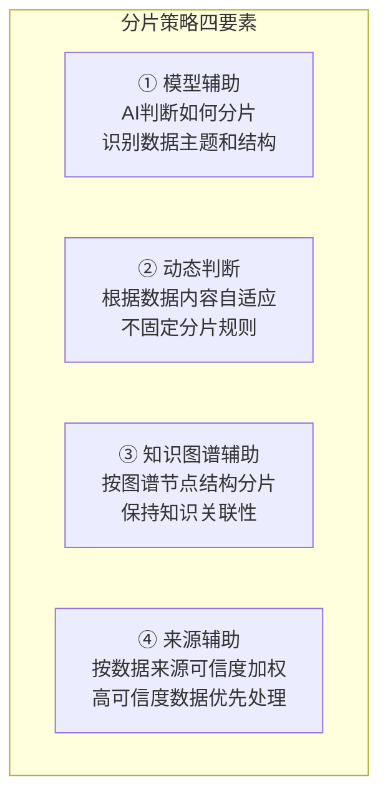

| 要素     | 说明                    |
|--------|-----------------------|
| 模型辅助   | AI判断如何分片，识别数据主题和结构    |
| 动态判断   | 根据数据内容自适应，不固定分片规则     |
| 知识图谱辅助 | 按图谱节点结构分片，保持知识关联性     |
| 来源辅助   | 按数据来源可信度加权，高可信度数据优先处理 |

### 6.6 来源可信度加权

#### 6.6.1 优先级排序

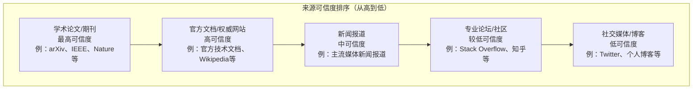

#### 6.6.2 加权应用场景

| 场景         | 应用方式       |
|------------|------------|
| 多条信息冲突时    | 优先采用高可信度来源 |
| 知识图谱节点权重计算 | 作为权重参考因子   |
| 精筛阶段判断依据   | 影响筛选决策     |

### 6.7 知识图谱构建

#### 6.7.1 构建时机

**在"合"阶段同步构建**

- 数据整合时，识别实体和关系
- 边合并边构建图谱结构
- 代表知识的完整性和确立性

#### 6.7.2 构建策略

**直接抄市面上成熟的方案**

- 现有成熟框架可直接复用
- 不需要重新设计底层结构
- 节点/边/关系等都有标准做法

#### 6.7.3 图谱作用

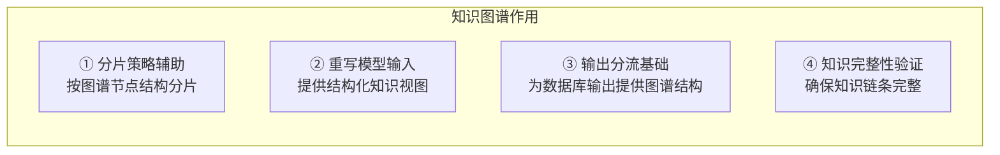

### 6.8 多模型投票机制

#### 6.8.1 精筛阶段投票

```mermaid
flowchart TB
    INPUT["分片数据"]
    A["模型A筛选"]
    B["模型B筛选"]
    C["模型C筛选"]
    INPUT --> A
    INPUT --> B
    INPUT --> C
    A --> INTERSECT["取交集<br/>共同认可的内容"]
    B --> INTERSECT
    C --> INTERSECT
    INTERSECT --> OUTPUT["精炼数据"]
    PRINCIPLE["核心原则：多方认可才算通过"]
```

### 6.9 模型重写机制

#### 6.9.1 输入与输出

```mermaid
flowchart LR
    subgraph Input["输入（给重写模型看的）"]
        I1["结构化数据"]
        I2["知识图谱"]
        I3["可信度加权信息"]
    end

    subgraph Process["处理"]
        P1["模型系统性梳理"]
        P2["确保知识完整性"]
        P3["去除冗余、补充缺失"]
    end

    subgraph Output["输出（根据用户选择）"]
        O1["MD文件 → 直接输出MD"]
        O2["PDF → 先输出文本，再转换"]
        O3["数据库 → 向量化后入库"]
        O4["其他格式 → 按流程处理"]
    end

    Input --> Process --> Output
```

#### 6.9.2 核心原则

- **永远不直接输出原始结果**
- 必须让模型基于精炼数据重写/梳理一遍
- 输出阶段就是**"抄答案"**，按成熟方案处理

### 6.10 设计一致性

```mermaid
flowchart TB
    subgraph Stage1["第一阶段"]
        S1["多轮转换 + 旁系监督 + 网络验证"]
    end

    subgraph Stage2["第二阶段"]
        S2["多模型拆分 + 多品审核 + 单决策"]
    end

    subgraph Stage3["第三阶段"]
        S3["分合策略 + 多模型投票 + 模型重写"]
    end

    PRINCIPLE["核心原则：多方参与、投票决策、去伪存真、质量优先"]
    Stage1 --> PRINCIPLE
    Stage2 --> PRINCIPLE
    Stage3 --> PRINCIPLE
```

### 6.11 第三阶段输出

| 输出项   | 说明             |
|-------|----------------|
| 结构化数据 | 精炼后的数据，按知识图谱组织 |
| 知识图谱  | 完整的知识关系网络      |
| 可信度信息 | 各数据的来源可信度标注    |

### 6.12 待后续版本迭代优化

- 来源可信度权重的精确数值
- 分片策略的动态判断算法
- 知识图谱的具体构建框架选择

---

## 七、第四阶段：输出分流机制

### 7.1 阶段目标

接收第三阶段产出的结构化数据和知识图谱，根据用户配置分流到不同输出路径，最终产出用户所需的文件或数据库记录。

### 7.2 核心理念

```mermaid
mindmap
  root((输出分流核心理念))
    用户可配置
      输出格式（文件/数据库）
      输出路径
      输出模板
      输出内容
    抄答案
      文件格式模板：市面上成熟方案直接抄
      数据库结构：按固定结构输出
      知识图谱：独立文件输出
    知识图谱为核心
      独立输出为一个文件
      其他数据配合知识图谱结构
```

### 7.3 整体流程架构

```mermaid
flowchart TB
    INPUT["结构化数据 + 知识图谱<br/>（来自第三阶段）"]

    subgraph Config["用户配置读取"]
        C1["输出类型（文件/数据库）"]
        C2["输出格式（MD/PDF/JSON/...）"]
        C3["输出路径"]
        C4["输出模板"]
        C5["输出内容范围"]
    end

    subgraph Dispatch["分流处理"]
        D1["知识图谱文件<br/>独立输出"]
        D2["数据库输出<br/>用户选择数据库类型<br/>按固定结构输出"]
        D3["文件输出<br/>模板化输出<br/>抄成熟方案"]
    end

    subgraph Output["输出完成"]
        O1["知识图谱文件"]
        O2["结构化数据文件/数据库记录"]
        O3["用户指定格式的文档"]
    end

    INPUT --> Config
    Config --> Dispatch
    Dispatch --> Output
```

### 7.4 用户可配置项

| 配置项   | 说明      | 选项示例            |
|-------|---------|-----------------|
| 输出类型  | 文件还是数据库 | 文件/数据库/两者       |
| 输出格式  | 文件的具体格式 | MD/PDF/JSON/... |
| 输出路径  | 文件存储位置  | 用户指定路径          |
| 输出模板  | 格式化模板   | 用户自定义模板         |
| 输出内容  | 输出哪些内容  | 全部/部分/筛选        |
| 数据库类型 | 数据库选择   | 向量库/关系库/..      |

### 7.5 输出路径详解

#### 7.5.1 知识图谱输出

**作为核心文件独立输出**

| 属性 | 说明                      |
|----|-------------------------|
| 格式 | JSON / GraphML / 其他图谱格式 |
| 作用 | 提供知识结构视图                |
| 配合 | 其他数据输出时参考图谱结构           |

**示例输出文件：**

- `knowledge_graph.json`（知识图谱）
- `structured_data.json`（结构化数据）
- `output.md`（文档输出）

#### 7.5.2 数据库输出

```mermaid
flowchart TB
    subgraph VectorDB["向量数据库"]
        V1["结构化数据 → 向量化处理 → 入库"]
        V2["知识图谱结构映射到向量存储"]
        V3["例：Milvus、Pinecone、Weaviate等"]
    end

    subgraph RelationalDB["关系数据库"]
        R1["结构化数据 → 表结构映射 → 入库"]
        R2["知识图谱可存储为节点表+关系表"]
        R3["例：PostgreSQL、MySQL等"]
    end

    subgraph GraphDB["图数据库"]
        G1["知识图谱直接导入"]
        G2["例：Neo4j、GraphDB等"]
    end

    PRINCIPLE["核心原则：按固定结构输出，抄成熟方案"]
```

#### 7.5.3 文件输出

**模板化输出**

| 文件类型  | 处理方式                                   |
|-------|----------------------------------------|
| MD文件  | 模板化格式输出，抄市面上成熟的MD模板，用户可自定义模板           |
| PDF文件 | 先输出文本内容，再通过工具转换为PDF（例：使用Pandoc、LaTeX等） |
| 其他格式  | JSON、YAML、CSV等，按用户需求配置                 |

**核心原则：抄成熟模板方案**

### 7.6 输出文件示例

```
用户任务：傅里叶变换知识检索

输出目录结构：
├── output/
│   ├── knowledge_graph.json     # 知识图谱文件
│   ├── structured_data.json     # 结构化数据
│   ├── 傅里叶变换知识手册.md     # MD格式文档（用户选择）
│   └── 傅里叶变换知识手册.pdf    # PDF格式文档（用户选择）
│
数据库输出（用户选择）：
├── 向量数据库：知识向量集合
├── 图数据库：知识图谱节点和关系
```

### 7.7 设计一致性

```mermaid
flowchart TB
    subgraph Stage1["第一阶段"]
        S1["多轮转换 + 旁系监督 + 网络验证"]
    end

    subgraph Stage2["第二阶段"]
        S2["多模型拆分 + 多品审核 + 单决策"]
    end

    subgraph Stage3["第三阶段"]
        S3["分合策略 + 多模型投票 + 模型重写"]
    end

    subgraph Stage4["第四阶段"]
        S4["用户配置 + 模板输出 + 抄成熟方案"]
    end

    PRINCIPLE["核心原则：多方参与、投票决策、去伪存真、用户可控"]
    Stage1 --> PRINCIPLE
    Stage2 --> PRINCIPLE
    Stage3 --> PRINCIPLE
    Stage4 --> PRINCIPLE
```

### 7.8 第四阶段输出

| 输出项     | 说明                   |
|---------|----------------------|
| 知识图谱文件  | JSON/GraphML等格式的图谱文件 |
| 结构化数据文件 | JSON等格式的数据文件         |
| 文档文件    | MD/PDF等用户指定格式        |
| 数据库记录   | 向量库/图库等用户指定数据库       |

### 7.9 待后续版本迭代优化

- 更多输出格式的支持
- 输出模板的丰富和完善
- 数据库类型的扩展

---

## 八、系统关键创新点

```mermaid
mindmap
  root((系统关键创新点))
    球形知识空间
      以核心主题为圆心
      知识链条为半径
      允许球形扩展
      不允许跨圈跳跃
    备忘录迭代机制
      搜+读+发现过程中发现新连锁信息
      整评审后触发新一轮搜索
    多模型投票贯穿全流程
      每个阶段都有多方参与
      投票决策
      避免单一模型偏见和遗漏
    知识图谱同步构建
      筛选过程中同步构建图谱
      代表知识完整性和确立性
    模型重写不直接输出
      原始数据必须经过模型系统性重写
      确保输出质量和结构化
```

### 创新点详解

| 创新点        | 说明                              |
|------------|---------------------------------|
| 球形知识空间     | 以核心主题为圆心，知识链条为半径；允许球形扩展，不允许跨圈跳跃 |
| 备忘录迭代机制    | 搜+读+发现过程中发现新连锁信息，整评审后触发新一轮搜索    |
| 多模型投票贯穿全流程 | 每个阶段都有多方参与、投票决策；避免单一模型偏见和遗漏     |
| 知识图谱同步构建   | 筛选过程中同步构建图谱；代表知识完整性和确立性         |
| 模型重写不直接输出  | 原始数据必须经过模型系统性重写；确保输出质量和结构化      |

---

## 九、示例场景：傅里叶变换知识检索

```mermaid
flowchart TB
    INPUT["用户输入：'我想知道傅里叶变换的数学知识'"]

    subgraph Stage1["第一阶段：需求解析"]
        S1A["输入：'傅里叶变换的数学知识'"]
        S1B["多轮转换：解析 → 扩展 → 验证 → 细化"]
        S1C["球形知识空间：以傅里叶变换为核心"]
        S1D["工程化提示词：人物/原理/历史/应用等维度"]
        S1A --> S1B --> S1C --> S1D
    end

    subgraph Stage2["第二阶段：智能检索"]
        S2A["提示词拆分 → 多模型并行搜索"]
        S2B["搜索：傅里叶本人、提出背景、数学原理、应用领域"]
        S2C["备忘录发现：傅里叶与热传导研究的关系"]
        S2D["评审通过 → 重构提示词 → 新一轮搜索"]
        S2E["海量HTML数据"]
        S2A --> S2B --> S2C --> S2D --> S2E
    end

    subgraph Stage3["第三阶段：数据筛选"]
        S3A["初筛：去标签、去广告"]
        S3B["合并：整合数据 + 构建知识图谱"]
        S3C["分片：按图谱节点分片 + 来源加权"]
        S3D["精筛：多模型投票取交集"]
        S3E["重写：模型系统性梳理 → 结构化数据"]
        S3A --> S3B --> S3C --> S3D --> S3E
    end

    subgraph Stage4["第四阶段：输出分流"]
        S4A["用户配置：MD文档 + 知识图谱JSON"]
        S4B["输出："]
        S4C["knowledge_graph.json"]
        S4D["傅里叶变换知识手册.md"]
        S4E["傅里叶变换知识手册.pdf"]
        S4A --> S4B --> S4C
        S4B --> S4D
        S4B --> S4E
    end

    INPUT --> Stage1
    Stage1 --> Stage2
    Stage2 --> Stage3
    Stage3 --> Stage4
```

---

## 十、设计一致性总结

```mermaid
flowchart TB
    subgraph Summary["四阶段设计一致性"]
        S1["第一阶段<br/>多轮转换 + 旁系监督<br/>多方参与、监督验证"]
        S2["第二阶段<br/>多模型拆分 + 多品审核<br/>投票决策、去伪存真"]
        S3["第三阶段<br/>分合策略 + 多模型投票<br/>质量优先、图谱构建"]
        S4["第四阶段<br/>用户配置 + 模板输出<br/>用户可控、抄成熟方案"]
    end

    subgraph Principles["全流程贯穿"]
        P1["• 不依赖模型记忆，三方求证"]
        P2["• 多模型投票，避免偏见"]
        P3["• 知识图谱为核心"]
        P4["• 最终输出必须模型重写"]
    end

    S1 --> Principles
    S2 --> Principles
    S3 --> Principles
    S4 --> Principles
```

| 阶段   | 核心机制         | 共同原则       |
|------|--------------|------------|
| 第一阶段 | 多轮转换 + 旁系监督  | 多方参与、监督验证  |
| 第二阶段 | 多模型拆分 + 多品审核 | 投票决策、去伪存真  |
| 第三阶段 | 分合策略 + 多模型投票 | 质量优先、图谱构建  |
| 第四阶段 | 用户配置 + 模板输出  | 用户可控、抄成熟方案 |

**全流程贯穿：**

- 不依赖模型记忆，三方求证
- 多模型投票，避免偏见
- 知识图谱为核心
- 最终输出必须模型重写

---

## 十一、技术选型与实现架构

> **核心原则**：优先本地部署，减少外部API依赖，数据完全可控

### 11.1 整体技术栈概览

```mermaid
flowchart TB
    subgraph UI["UI层"]
        UI1["桌面应用<br/>PyQt6/PySide6"]
    end

    subgraph Business["业务逻辑层"]
        B1["需求解析模块"]
        B2["智能检索模块"]
        B3["数据筛选模块"]
        B4["输出分流模块"]
    end

    subgraph Core["核心抽象层"]
        C1["ModelProvider<br/>多模型投票接口"]
        C2["SearchProvider<br/>搜索引擎抽象接口"]
        C3["KnowledgeGraph<br/>知识图谱构建"]
        C4["RAGPipeline<br/>RAG流水线"]
    end

    subgraph Model["模型层"]
        M1["Ollama<br/>本地推理引擎"]
        M2["Qwen 3.5 7B/14B<br/>主力模型"]
        M3["DeepSeek-R1<br/>推理模型"]
        M4["API扩展接口<br/>未来版本预留"]
    end

    subgraph Search["搜索层"]
        S1["SearXNG<br/>本地元搜索引擎"]
        S2["Playwright<br/>网页深度抓取"]
        S3["API扩展接口<br/>未来版本预留"]
    end

    subgraph Data["数据层"]
        D1["Chroma/Milvus<br/>向量数据库"]
        D2["Neo4j<br/>图数据库"]
        D3["本地文件<br/>JSON/MD输出"]
    end

    subgraph Config["配置层"]
        CF1["settings.yaml<br/>主配置"]
        CF2["prompts/<br/>提示词模板"]
        CF3["models.yaml<br/>模型配置"]
    end

    UI --> Business
    Business --> Core
    Core --> Model
    Core --> Search
    Core --> Data
    Config --> Core
```

### 11.2 模型层技术选型

#### 11.2.1 推理框架选择

| 框架             | 特点                     | 集成方式               |
|----------------|------------------------|--------------------|
| **Ollama**（主力） | 一键部署、支持多模型、OpenAI兼容API | `ollama-python`官方库 |
| vLLM           | 高吞吐量推理、适合生产部署          | OpenAI兼容API        |
| llama.cpp      | 纯CPU推理、低资源环境           | GGUF格式             |

**Python集成示例**：

```python
# 方式一：ollama-python官方库
from ollama import chat
response = chat(
    model="qwen3.5:7b",
    messages=[{"role": "user", "content": "你好"}]
)

# 方式二：OpenAI兼容API（可切换其他框架）
from openai import OpenAI
client = OpenAI(base_url="http://localhost:11434/v1", api_key="ollama")
response = client.chat.completions.create(
    model="qwen3.5:7b",
    messages=[{"role": "user", "content": "你好"}]
)
```

#### 11.2.2 模型选型矩阵

| 硬件配置   | 推荐模型                         | 参数规模 | 适用场景          |
|--------|------------------------------|------|---------------|
| 8GB显存  | Qwen 3.5 4B/7B               | 轻量级  | 通用对话、基础推理     |
| 16GB显存 | Qwen 3.5 9B/14B              | 中等规模 | 复杂任务、高质量输出    |
| 24GB显存 | Qwen 3.5 35B-A3B (MoE)       | 大规模  | 旗舰级推理、多模型投票主力 |
| 无独显    | Qwen 3.5 0.8B/2B + llama.cpp | 极轻量  | 端侧部署、低资源环境    |

**特殊用途模型**：

| 场景      | 推荐模型               | 说明     |
|---------|--------------------|--------|
| 数学/代码推理 | DeepSeek-R1 7B/14B | 推理能力顶尖 |
| 英文任务    | Llama 3.1 8B       | 英文最强开源 |

#### 11.2.3 多模型投票实现

```mermaid
flowchart TB
    subgraph Voting["多模型投票机制"]
        V1["任务分发"]
        V2["模型A处理"]
        V3["模型B处理"]
        V4["模型C处理"]
        V5["结果汇总"]
        V6["投票决策"]
        V7["最终输出"]
        V1 --> V2
        V1 --> V3
        V1 --> V4
        V2 --> V5
        V3 --> V5
        V4 --> V5
        V5 --> V6
        V6 --> V7
    end
```

**ModelProvider抽象接口设计**：

```python
class ModelProvider(ABC):
    """多模型统一调用抽象接口"""
    
    @abstractmethod
    def call(self, prompt: str, model: str) -> str:
        """单模型调用"""
        pass
    
    @abstractmethod
    def vote(self, prompt: str, models: list[str]) -> VoteResult:
        """多模型投票决策"""
        pass
    
    @abstractmethod
    def add_provider(self, name: str, provider: ModelProvider):
        """添加新的模型提供者（扩展接口）"""
        pass
```

### 11.3 搜索层技术选型

> **核心思路**：用户电脑上有浏览器 → Playwright操控浏览器访问搜索引擎 → 免费获取搜索结果
>
> **零成本搜索**：绕过付费API，直接使用浏览器访问Google/Bing/百度等搜索引擎

#### 11.3.1 为什么不用搜索API？

| 方案                         | 成本       | 限制              |
|----------------------------|----------|-----------------|
| 搜索API（Google/Bing/SerpAPI） | 付费，按次数计费 | 需要API Key、有调用限制 |
| **浏览器直接访问**                | **完全免费** | 无限制，模拟真实用户行为    |

**关键洞察**：搜索引擎的网页版是免费开放的，API是付费的。既然用户电脑上有浏览器，为什么不用呢？

#### 11.3.2 技术方案：Playwright操控浏览器

```mermaid
flowchart LR
    A[用户搜索请求] --> B[Playwright启动浏览器]
    B --> C[访问搜索引擎]
    C --> D[解析搜索结果页面]
    D --> E[提取标题/链接/摘要]
    E --> F[返回结构化数据]
```

**支持的搜索引擎**（按用户网络环境自动选择）：

| 搜索引擎           | 适用场景  | 特点             |
|----------------|-------|----------------|
| **Google**     | 国际搜索  | 结果最全面，需网络环境支持  |
| **Bing**       | 国际/国内 | 微软搜索引擎，国内可访问   |
| **百度**         | 中文搜索  | 国内首选，中文结果优秀    |
| **DuckDuckGo** | 隐私搜索  | 不追踪用户，结果来自Bing |

#### 11.3.3 核心代码实现

**搜索实现**：

```python
from playwright.sync_api import sync_playwright
from dataclasses import dataclass

@dataclass
class SearchResult:
    title: str
    url: str
    snippet: str
    source: str  # 来源搜索引擎

def search(query: str, engine: str = "google", max_results: int = 10) -> list[SearchResult]:
    """
    使用Playwright操控浏览器执行搜索
    
    Args:
        query: 搜索关键词
        engine: 搜索引擎 (google/bing/baidu)
        max_results: 最大结果数
    """
    # 搜索引擎URL模板
    engines = {
        "google": f"https://www.google.com/search?q={query}",
        "bing": f"https://www.bing.com/search?q={query}",
        "baidu": f"https://www.baidu.com/s?wd={query}",
    }
    
    with sync_playwright() as p:
        # 使用用户系统已安装的浏览器，或Playwright自带浏览器
        browser = p.chromium.launch(headless=True)
        page = browser.new_page()
        
        # 访问搜索引擎
        page.goto(engines[engine])
        
        # 解析搜索结果（不同引擎的选择器不同）
        results = parse_search_results(page, engine, max_results)
        
        browser.close()
        return results

def parse_search_results(page, engine: str, max_results: int) -> list[SearchResult]:
    """解析搜索结果页面"""
    results = []
    # 根据不同引擎使用不同的选择器
    # Google: div.g > div[data-sncf]
    # Bing: li.b_algo
    # Baidu: div.result
    # ...具体实现根据页面结构调整
    return results[:max_results]
```

**网页内容抓取**：

```python
def fetch_page_content(url: str) -> str:
    """抓取网页完整内容"""
    with sync_playwright() as p:
        browser = p.chromium.launch(headless=True)
        page = browser.new_page()
        page.goto(url, wait_until="networkidle")
        
        # 提取正文内容（去除导航、广告等）
        content = page.evaluate("""
            () => {
                // 移除不需要的元素
                const remove = ['nav', 'header', 'footer', 'aside', 'script', 'style', 'ads'];
                remove.forEach(tag => {
                    document.querySelectorAll(tag).forEach(el => el.remove());
                });
                return document.body.innerText;
            }
        """)
        
        browser.close()
        return content
```

#### 11.3.4 方案对比与选择

| 方案                     | 成本 | 部署难度        | 推荐度           |
|------------------------|----|-------------|---------------|
| **Playwright直接搜索**（主力） | 免费 | pip install | ⭐⭐⭐⭐⭐ 推荐      |
| ddgs库（DuckDuckGo）      | 免费 | pip install | ⭐⭐⭐ 备选（有频率限制） |
| SearXNG（Docker）        | 免费 | 需Docker部署   | ⭐⭐ 可选增强       |
| 搜索API                  | 付费 | 需API Key    | ⭐ 不推荐         |

#### 11.3.5 SearchProvider抽象接口

```python
class SearchProvider(ABC):
    """搜索引擎抽象接口"""
    
    @abstractmethod
    def search(self, query: str, max_results: int) -> list[SearchResult]:
        """执行搜索"""
        pass
    
    @abstractmethod
    def fetch_content(self, url: str) -> str:
        """抓取网页内容"""
        pass
    
    @abstractmethod
    def add_api_provider(self, name: str, config: dict):
        """添加API扩展（未来版本预留）"""
        pass
```

### 11.4 数据层技术选型

| 数据类型 | 技术选型                    | 部署方式     |
|------|-------------------------|----------|
| 向量存储 | Chroma（轻量）/ Milvus（高性能） | 本地Docker |
| 知识图谱 | Neo4j                   | 本地Docker |
| 文件输出 | JSON/Markdown/PDF       | 本地文件系统   |

### 11.5 UI层技术选型

| 方案           | 技术栈             | 说明               |
|--------------|-----------------|------------------|
| **桌面UI**（主力） | PyQt6 / PySide6 | 本地桌面应用、任务管理、进度展示 |

**UI核心功能**：

- 任务提交与管理
- 进度可视化展示
- 配置参数调整
- 结果预览与导出

### 11.6 项目目录结构设计

```
RAG/
├── main.py                 # 入口文件
├── pyproject.toml           # 项目配置
├── config/                  # 配置层
│   ├── settings.yaml        # 主配置文件
│   ├── models.yaml          # 模型配置
│   └── prompts/             # 提示词模板目录
│       ├── stage1_parse.yaml
│       ├── stage2_search.yaml
│       ├── stage3_filter.yaml
│       └── stage4_output.yaml
├── src/                     # 源代码目录
│   ├── core/                # 核心抽象层
│   │   ├── model_provider.py    # 模型抽象接口
│   │   ├── search_provider.py   # 搜索抽象接口
│   │   ├── knowledge_graph.py   # 知识图谱构建
│   │   └── rag_pipeline.py      # RAG流水线
│   │   └── vote_engine.py       # 多模型投票引擎
│   ├── stage1_requirement/      # 第一阶段：需求解析
│   ├── stage2_search/           # 第二阶段：智能检索
│   ├── stage3_filter/           # 第三阶段：数据筛选
│   ├── stage4_output/           # 第四阶段：输出分流
│   ├── ui/                      # UI层
│   │   ├── main_window.py       # 主窗口
│   │   ├── task_panel.py        # 任务面板
│   │   └── config_panel.py      # 配置面板
│   └── utils/                   # 工具函数
├── data/                     # 数据存储目录
│   ├── vector_db/            # 向量数据库
│   ├── graph_db/             # 图数据库
│   └── output/               # 输出文件
├── test/                     # 测试目录
└── docs/                     # 文档目录
```

### 11.7 开发阶段规划

```mermaid
flowchart LR
    subgraph P0["Phase 0: 项目骨架"]
        P0A["目录结构"]
        P0B["配置层"]
        P0C["抽象接口定义"]
    end

    subgraph P1["Phase 1: 核心层"]
        P1A["ModelProvider"]
        P1B["SearchProvider"]
        P1C["投票引擎"]
    end

    subgraph P2["Phase 2: 模型接入"]
        P2A["Ollama集成"]
        P2B["多模型配置"]
        P2C["投票测试"]
    end

    subgraph P3["Phase 3: 搜索接入"]
        P3A["Playwright搜索实现"]
        P3B["多引擎适配"]
        P3C["搜索测试"]
    end

    subgraph P4["Phase 4: 业务实现"]
        P4A["阶段1实现"]
        P4B["阶段2实现"]
        P4C["阶段3实现"]
        P4D["阶段4实现"]
    end

    subgraph P5["Phase 5: UI开发"]
        P5A["主窗口"]
        P5B["任务面板"]
        P5C["配置面板"]
    end

    subgraph P6["Phase 6: 测试优化"]
        P6A["集成测试"]
        P6B["性能优化"]
        P6C["文档完善"]
    end

    P0 --> P1 --> P2 --> P3 --> P4 --> P5 --> P6
```

| 阶段      | 主要任务    | 输出物                                         |
|---------|---------|---------------------------------------------|
| Phase 0 | 搭建项目骨架  | 目录结构、配置文件、抽象接口定义                            |
| Phase 1 | 实现核心抽象层 | ModelProvider、SearchProvider、VoteEngine     |
| Phase 2 | 模型层接入   | Ollama集成、多模型配置、投票机制验证                       |
| Phase 3 | 搜索层接入   | Playwright搜索实现、多引擎适配（Google/Bing/百度）、搜索功能验证 |
| Phase 4 | 业务层实现   | 四阶段流程逐一实现                                   |
| Phase 5 | UI层开发   | 桌面UI完整功能                                    |
| Phase 6 | 测试与优化   | 整体测试、性能调优、文档完善                              |

### 11.8 扩展性设计

#### 11.8.1 模型层扩展

```mermaid
flowchart TB
    subgraph Current["当前版本"]
        C1["Ollama本地模型"]
    end

    subgraph Future["未来版本扩展"]
        F1["远程API接入"]
        F2["自定义模型"]
        F3["分布式推理"]
    end

    Current --> Future
```

通过ModelProvider抽象接口，未来可无缝扩展：

- 远程API模型（OpenAI、Claude、DeepSeek API等）
- 自定义微调模型
- 多机分布式推理

#### 11.8.2 搜索层扩展

```mermaid
flowchart TB
    subgraph Current["当前版本"]
        C1["SearXNG本地"]
        C2["Playwright抓取"]
    end

    subgraph Future["未来版本扩展"]
        F1["Serper API"]
        F2["Google Custom Search"]
        F3["自定义搜索源"]
    end

    Current --> Future
```

通过SearchProvider抽象接口，未来可无缝扩展：

- 商业搜索API
- 垂直领域搜索引擎
- 自定义数据源接入

---

## 十二、后续工作方向

| 方向    | 说明                         | 状态    |
|-------|----------------------------|-------|
| 技术选型  | 确定具体LLM模型、数据库、框架等          | ✅ 已完成 |
| 项目骨架  | Phase 0 目录结构与抽象接口          | 待开发   |
| 核心层实现 | Phase 1 抽象层与投票引擎           | 待开发   |
| 模型接入  | Phase 2 Ollama集成           | 待开发   |
| 搜索接入  | Phase 3 SearXNG/Playwright | 待开发   |
| 业务实现  | Phase 4 四阶段流程              | 待开发   |
| UI开发  | Phase 5 桌面应用               | 待开发   |
| 测试优化  | Phase 6 整体测试与迭代            | 待开发   |

---

**文档版本**：v2.0  
**最后更新**：2026-03-29  
**更新内容**：新增第十一章技术选型与实现架构，更新后续工作方向状态