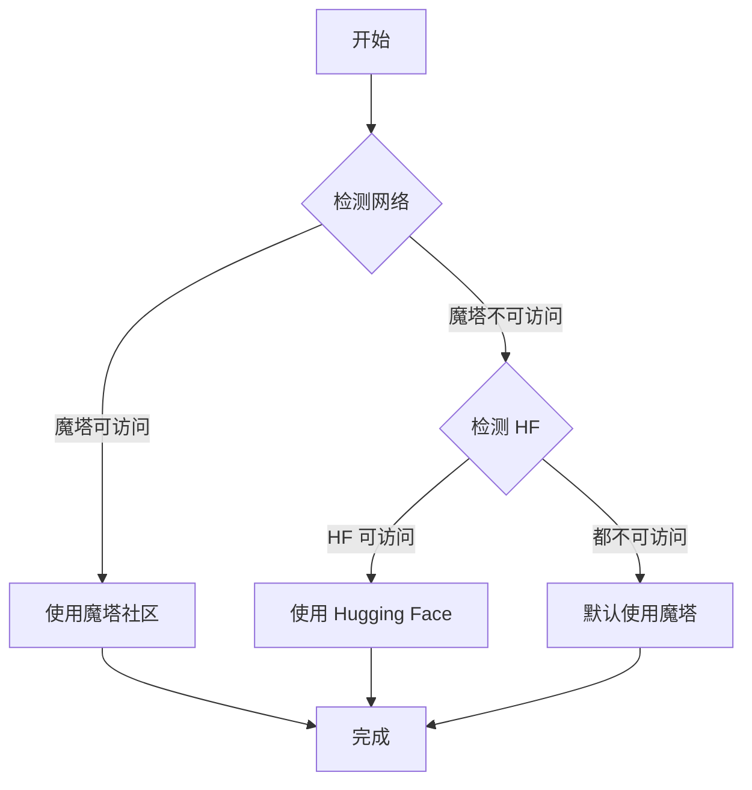

# 模型源使用指南

本文档介绍如何配置和使用 Ikos 的**智能模型源选择**功能。

## 核心功能

Ikos 支持从两个主流模型社区下载模型：

1. **魔塔社区（ModelScope）** 🇨🇳
   - 阿里巴巴达摩院出品
   - 国内访问速度快
   - **默认首选**

2. **Hugging Face** 🌍
   - 国际知名模型社区
   - 模型种类丰富
   - 国内访问可能较慢

### 智能选择机制

系统会**自动检测网络环境**，选择最优模型源：



## 配置方式

### 方式一：配置文件（推荐）

编辑 `config/settings.yaml`：

```yaml
model:
  source:
    # 模型源选择：auto / modelscope / huggingface
    preferred: "auto"  # 默认自动检测
    
    # 是否使用缓存
    use_cache: true
    
    # 检测超时时间（秒）
    timeout: 3.0
```

**配置选项说明**：

| 选项 | 值 | 说明 |
|------|-----|------|
| `preferred` | `auto` | 自动检测（推荐） |
| | `modelscope` | 强制使用魔塔社区 |
| | `huggingface` | 强制使用 Hugging Face |
| `use_cache` | `true` | 使用缓存结果（推荐） |
| `timeout` | `3.0` | 网络检测超时（秒） |

### 方式二：代码指定

```python
from ikos.utils import ModelSourceSelector

# 自动检测
selector = ModelSourceSelector(preferred="auto")
source = selector.detect()

# 强制使用魔塔
selector = ModelSourceSelector(preferred="modelscope")
source = selector.detect()  # 返回 "modelscope"

# 强制使用 Hugging Face
selector = ModelSourceSelector(preferred="huggingface")
source = selector.detect()  # 返回 "huggingface"
```

## 使用示例

### 示例 1：下载模型

```python
from ikos.utils.model_downloader import download_model

# 自动选择最优源下载模型
model_path = download_model(
    model_id="damo/nlp_csanmt_translationzh2en",
    cache_dir="./models",
    preferred_source="auto"  # 自动选择
)

print(f"模型已下载到：{model_path}")
```

### 示例 2：检查当前使用的源

```python
from ikos.utils import is_modelscope, is_huggingface, get_model_source

# 检查是否使用魔塔社区
if is_modelscope():
    print("✅ 当前使用魔塔社区")
else:
    print("✅ 当前使用 Hugging Face")

# 获取具体源
source = get_model_source()
print(f"模型源：{source}")
```

### 示例 3：手动切换源

```python
from ikos.utils import ModelSourceSelector

# 创建选择器
selector = ModelSourceSelector(preferred="auto")

# 查看当前选择
print(f"当前源：{selector.detect()}")

# 强制切换到 Hugging Face
selector.preferred = "huggingface"
selector.reset_cache()  # 清除缓存
print(f"切换后源：{selector.detect()}")
```

### 示例 4：获取下载 URL

```python
from ikos.utils import ModelSourceSelector

selector = ModelSourceSelector(preferred="auto")

# 获取模型下载页面 URL
url = selector.get_download_url(
    model_id="damo/nlp_csanmt_translationzh2en",
    revision="master"
)

print(f"下载 URL: {url}")
# 输出：https://www.modelscope.cn/models/damo/nlp_csanmt_translationzh2en/files
```

## 网络检测原理

系统通过**Socket 连接检测**判断模型源的可访问性：

```python
import socket

def check_host(host: str, port: int = 443, timeout: float = 3.0) -> bool:
    """检查主机是否可访问"""
    try:
        socket.setdefaulttimeout(timeout)
        with socket.create_connection((host, port), timeout=timeout):
            return True
    except (socket.timeout, socket.error, OSError):
        return False

# 检测魔塔社区
modelscope_available = check_host("www.modelscope.cn")

# 检测 Hugging Face
huggingface_available = check_host("huggingface.co")
```

### 检测逻辑

1. **优先检测魔塔社区**（`www.modelscope.cn:443`）
   - 可访问 → 使用魔塔
   - 不可访问 → 检测 Hugging Face

2. **检测 Hugging Face**（`huggingface.co:443`）
   - 可访问 → 使用 Hugging Face
   - 不可访问 → 默认使用魔塔（作为 fallback）

## 常见问题

### Q1: 如何强制使用魔塔社区？

**方法一**：修改配置文件
```yaml
model:
  source:
    preferred: "modelscope"  # 强制使用魔塔
```

**方法二**：代码指定
```python
from ikos.utils import ModelSourceSelector

selector = ModelSourceSelector(preferred="modelscope")
```

### Q2: 如何强制使用 Hugging Face？

```yaml
model:
  source:
    preferred: "huggingface"  # 强制使用 HF
```

### Q3: 如何清除缓存重新检测？

```python
from ikos.utils import ModelSourceSelector

selector = ModelSourceSelector()
selector.reset_cache()  # 清除缓存
source = selector.detect()  # 重新检测
```

### Q4: 两个源都不可访问怎么办？

系统会默认返回 `modelscope`，但实际下载会失败。此时需要：

1. 检查网络连接
2. 配置代理（如果使用 Hugging Face）
3. 使用镜像源

### Q5: 如何配置代理访问 Hugging Face？

```python
import os

# 设置 HTTP 代理
os.environ['HTTP_PROXY'] = 'http://127.0.0.1:7890'
os.environ['HTTPS_PROXY'] = 'http://127.0.0.1:7890'

# 然后使用 Hugging Face
from ikos.utils import ModelSourceSelector
selector = ModelSourceSelector(preferred="huggingface")
```

## 依赖安装

### 安装魔塔社区 SDK

```bash
pip install modelscope
```

### 安装 Hugging Face SDK

```bash
pip install huggingface_hub
```

### 安装全部依赖

```bash
pip install modelscope huggingface_hub
```

## 性能优化

### 1. 启用缓存

```yaml
model:
  source:
    use_cache: true  # 启用缓存，避免重复检测
```

### 2. 调整超时时间

```yaml
model:
  source:
    timeout: 5.0  # 增加检测超时（网络较差时）
```

### 3. 预下载模型

```python
from ikos.utils.model_downloader import ModelDownloader

downloader = ModelDownloader()

# 提前下载模型
model_path = downloader.download("damo/nlp_csanmt_translationzh2en")

# 后续使用会直接从缓存加载
```

## 最佳实践

1. **国内用户**：使用 `auto` 或 `modelscope`（推荐）
2. **国际用户**：使用 `auto` 或 `huggingface`
3. **开发环境**：使用 `auto`，自动选择最优源
4. **生产环境**：明确指定源，避免不确定性

## 相关文档

- [架构文档](智能知识构建系统架构文档.md)
- [使用示例](../EXAMPLES.md)
- [CHANGELOG](../CHANGELOG.md)
